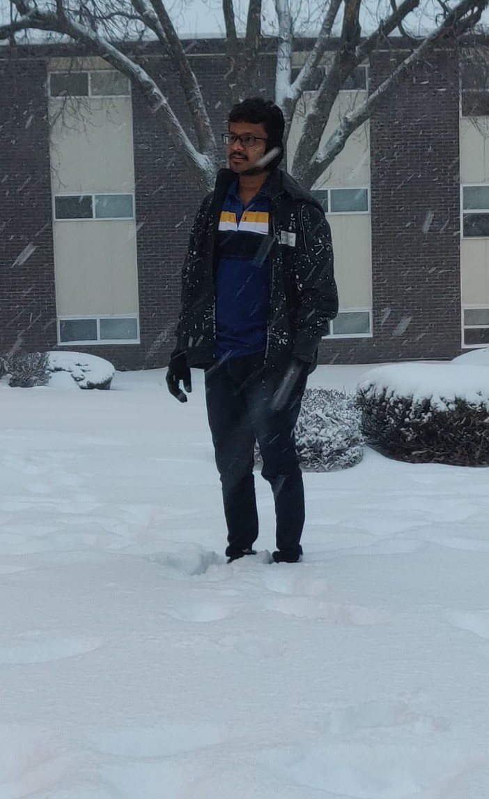

# GUNDA SAI NAGA ANU TEJA

I'm a cool going person. Always interested to learn new things to explore and to be updated.

Image: 



<br>

---
 
# Important places to visit
 
 
   1. Chikmagalur 
   2. Coorg
   3. Niagara falls
   4. Nandi hills

 Table format about important places to visit.Which includes location, number of hours visitors should spend and total amount it costs.

   location    | Hours to spend| Total Amount |  
 | ------------ | -------------: | ----------: |
 |  Chikmagalur|  6 | 10000rps |
 |   Coorg |  8 | 12000rps |
 | Niagara falls| 4 | 10000 $ |
 | Nandi hills | 3| 5000rps |
 
 ---
 ## TWO IMPORTANT QUOTES

 > Either write something worth reading or do something worth writing --*Benjamin Franklin*. <br>
 > Start before you’re ready --*Steven Pressfield*

 ***

 # Code Fencing

 >Script.NET : Script.NET or S# is a metaprogramming language that provides scripting functionality in Microsoft .NET applications, allowing runtime execution of custom functionality, similar to VBA in Microsoft Office applications.
 Quick link to source : <https://en.wikipedia.org/wiki/Script.NET>

```
 a=[17, 0, 5, 3,1, 2, 55];
for (i=0; i < a.Length; i=i+1)
 for (j=i+1; j <  a.Length; j=j+1)
   if (a[i] > a[j] )
   {
     temp = a[i]; 
     a[i] = a[j];
     a[j] = temp;
   }

s = 'Results:';
for (i=0; i < a.Length; i++)
  s = s + ',' + a[i];

MessageBox.Show(s);
```
<https://en.wikipedia.org/wiki/Script.NET#Hello_world>


 


